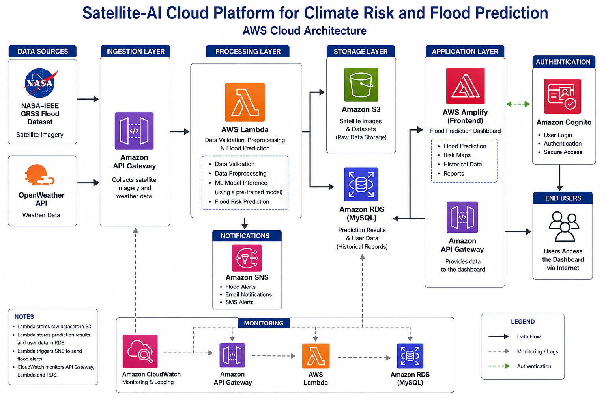

# System Architecture

## Overview

The Smart Flood Prediction System is a cloud-based platform that predicts flood risks using satellite imagery and weather data.

## Architecture Diagram

## Components

- Data Sources
- Data Collection
- AI Processing
- Cloud Storage
- Web Dashboard
- Notification Service
- Monitoring

## Data Flow

1. Satellite and weather data are collected.
2. Data is preprocessed.
3. The AI model predicts flood risk.
4. Results are stored in the cloud.
5. The dashboard displays predictions.
6. Alerts are sent to users.

# System Architecture

## Overview

The architecture of the Satellite-AI Cloud Platform is shown below.

## Architecture Diagram

