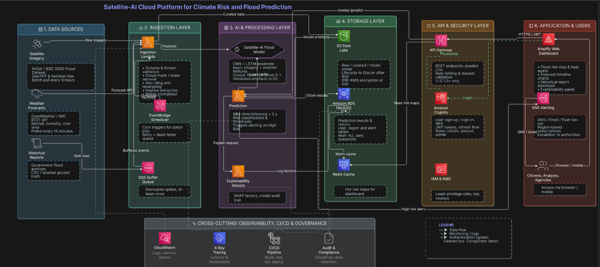

# System Architecture

## System Architecture Diagram

## Overview

The Smart Flood Prediction System is a cloud-based platform that integrates satellite imagery, weather data, artificial intelligence, and AWS cloud services to provide real-time flood prediction, risk assessment, visualization, and alert generation.

The architecture consists of six major layers along with a cross-cutting monitoring and governance layer.

---

## System Architecture Diagram

---

# 1. Data Sources

The system collects data from multiple trusted sources.

### Satellite Imagery
- NASA / IEEE GRSS Flood Dataset
- GeoTIFF and Sentinel satellite images
- Batch data collection every 6 hours

### Weather Forecasts
- OpenWeather API
- IMD Weather API
- Rainfall
- River water level
- Humidity
- Temperature

Weather information is collected every 15 minutes to provide near real-time environmental conditions.

### Historical Reports

Historical flood records and labelled datasets are used for AI model training and validation.

Examples include:
- Government flood archives
- CSV datasets
- Ground truth flood labels

---

# 2. Ingestion Layer

The ingestion layer receives and validates all incoming data before it is processed.

## AWS Lambda

Lambda performs:

- Data validation
- Schema verification
- Format validation
- Cloud masking
- Noise removal
- Geo-referencing
- Image normalization
- Feature extraction

The processed data is then forwarded to the AI model.

## EventBridge Scheduler

EventBridge automates scheduled execution by

- Running batch jobs
- Triggering weather updates
- Scheduling periodic satellite downloads
- Handling retry mechanisms

## Amazon SQS

SQS acts as a message queue that

- Buffers incoming requests
- Handles traffic spikes
- Provides reliable message delivery
- Prevents data loss

---

# 3. AI & Processing Layer

This is the intelligence layer of the system.

## Satellite-AI Flood Model

The prediction model receives

- Satellite imagery
- Weather parameters

The model performs flood prediction using a CNN + LSTM ensemble model.

### Model Outputs

- Flood probability
- Flood risk score
- Flood classification

The trained model artifacts are stored inside Amazon S3.

---

## Prediction Service

The prediction service performs

- Real-time inference
- Flood classification
- High-risk detection
- Alert triggering

Prediction latency is designed to remain below two seconds.

---

## Explainability Service

To improve transparency, the system generates explainability reports using SHAP.

The explainability module provides

- Feature importance
- Model reasoning
- Audit trail
- Prediction confidence

---

# 4. Storage Layer

The storage layer stores datasets, prediction results, and user information.

## Amazon S3 Data Lake

Amazon S3 stores

- Raw satellite images
- Processed datasets
- Curated datasets
- AI model files
- Versioned artifacts

S3 serves as the primary data lake for the application.

---

## Amazon RDS (MySQL)

Amazon RDS stores

- Prediction history
- User information
- Alert records
- Historical flood results

Daily database snapshots are maintained for backup and recovery.

---

## Redis Cache

Redis stores frequently accessed flood maps and prediction results.

Benefits include

- Faster dashboard loading
- Reduced database load
- Improved application performance

---

# 5. API & Security Layer

This layer secures and exposes the application services.

## Amazon API Gateway

API Gateway provides REST APIs including

- Prediction endpoint
- Flood map endpoint
- Historical data endpoint

Additional security includes

- Request validation
- Rate limiting
- HTTPS/TLS encryption

---

## Amazon Cognito

Amazon Cognito manages

- User registration
- User authentication
- Multi-factor authentication
- JWT token generation
- Role-based access control

Different user roles include

- Citizen
- Analyst
- Administrator

---

## IAM & AWS KMS

IAM controls access permissions using least-privilege policies.

AWS Key Management Service (KMS) manages encryption keys and secure data protection.

---

# 6. Application Layer

The frontend is developed using AWS Amplify.

The dashboard provides

- Flood prediction maps
- Heat maps
- Historical reports
- Risk visualization
- Forecast timeline
- Interactive charts

Users can access the application through any modern web browser.

---

## Notification Service

Amazon SNS provides real-time notifications.

Notifications include

- SMS alerts
- Email alerts
- Push notifications
- Escalation alerts for authorities

Alerts are automatically triggered when high flood risk is detected.

---

# Cross-Cutting Services

Several AWS services support every layer of the architecture.

## Amazon CloudWatch

Provides

- Monitoring
- Metrics
- Logging
- Performance alarms

---

## AWS X-Ray

Used for

- Distributed tracing
- Performance analysis
- Bottleneck identification

---

## CI/CD Pipeline

The CI/CD pipeline automates

- Build
- Testing
- Deployment
- Infrastructure as Code (IaC)

---

## Audit & Compliance

Ensures

- CloudTrail logging
- Data retention
- Compliance monitoring
- Security auditing

---

# Overall Workflow

1. Satellite imagery and weather data are collected from external data sources.
2. AWS Lambda validates and preprocesses the incoming data.
3. EventBridge schedules periodic data collection while SQS manages queued requests.
4. The AI prediction model analyzes satellite imagery and weather information.
5. Prediction results are stored in Amazon RDS, while datasets and trained models are stored in Amazon S3.
6. Redis caches frequently requested prediction results to improve performance.
7. API Gateway securely exposes prediction APIs to the frontend.
8. Amazon Cognito authenticates users before granting access.
9. AWS Amplify displays flood maps, risk analysis, and historical reports.
10. When a high-risk flood event is detected, Amazon SNS automatically sends alerts to users and authorities.
11. CloudWatch, X-Ray, and the CI/CD pipeline continuously monitor, maintain, and improve the system.